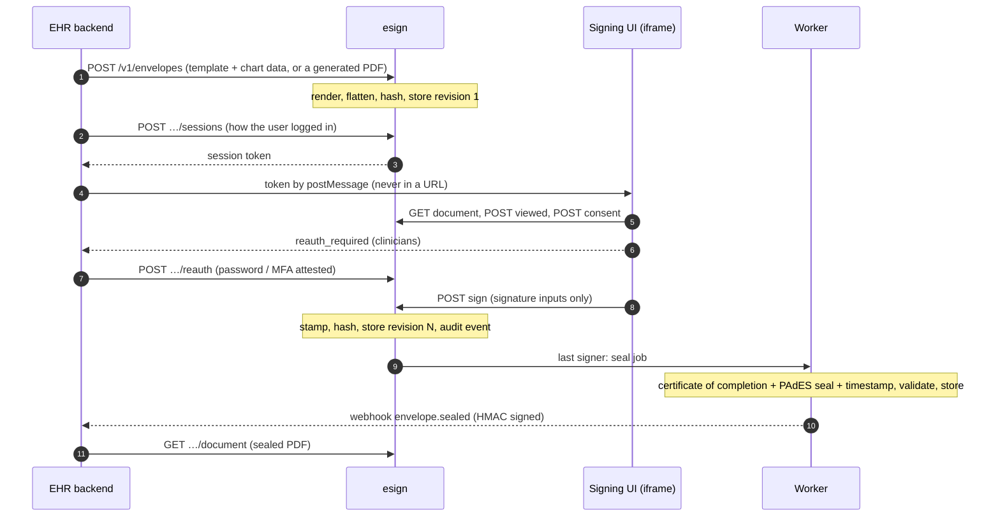

# esigning

Self-hosted, evidence-first electronic signatures for healthcare software.

An EHR embeds this service to collect legally binding signatures (ESIGN/UETA) from people it has
**already authenticated**: patients in a portal, patients on a clinic tablet, and clinicians
signing off on notes, orders and consents. PHI never leaves your infrastructure.

The product is evidence. If a signature is disputed years from now, the stored record alone has to
show **who** signed, **what** they saw, that they **meant** to sign, and that **nothing changed**
afterwards. Every design decision follows from that.

## What you get

| | |
|---|---|
| **Signing UI** | Embeddable, accessible, patient-friendly. Draw, type or click to sign. Works on a phone or a shared clinic tablet. |
| **Host API** | Server-to-server: create envelopes from templates or from generated per-patient reports, open sessions, attest re-authentication, fetch sealed PDFs, receive signed webhooks. |
| **Intent and consent** | Versioned ESIGN disclosure, explicit acceptance, every page viewed before the sign button unlocks, a decline-to-paper path that is always visible. |
| **Attribution** | Sessions bound to the EHR's own authentication. Clinicians re-authenticate at the moment of signing. Guardians, witnesses, interpreters and kiosk staff are recorded in their own capacity. |
| **Integrity** | One PAdES seal with an RFC 3161 timestamp, key held in KMS, validated before the document is ever reported complete. Never fails open. |
| **Audit trail** | Append-only, hash-chained, enforced by database triggers and role grants. The certificate of completion is generated from it, not alongside it. |
| **Storage** | Every revision content-addressed and write-once (S3 Object Lock in production). There is no delete path. |
| **Verification** | `esign verify <id>` re-checks the seal, every stored hash and the whole chain, and catches a swapped file or an edited audit row. |
| **Also** | Paper-signed scans archived with a staff attestation and sealed; saved signatures; a clinician signing queue; multi-signer envelopes in sequence or parallel. |

Deliberately out of scope: email-link signing for people without an account, a template builder,
bulk send, controlled-substance prescriptions, notarisation, non-US signature regimes.

## How it works



Every step writes an audit event in the same database transaction as the state change, so a
change without its event, or an event without its change, cannot exist.

Two decisions worth knowing before you read further:

- **One seal at the end, not one per signer.** The certificate of completion has to be inside the
  sealed bytes, and appending pages after a PDF signature breaks it. Each signer's step produces a
  hashed, stored, audit-chained revision; the final seal covers document plus certificate.
- **Never fail open.** If KMS, the timestamp authority or storage is down, the envelope stays
  `completed_pending_seal`, the failure is recorded, the job retries with backoff, and nothing
  reports the document as complete.

## Quick start

You need Docker, [`uv`](https://docs.astral.sh/uv/) and [`bun`](https://bun.sh/).

```sh
make install   # backend, demo host and frontend dependencies
make demo      # Postgres, migrations, dev PKI, API, worker, signing UI, demo EHR
```

Then open <http://localhost:8100> and sign in as one of the demo users (password `demo1234`):

| User | Try |
|---|---|
| `maria` | A patient signing a privacy acknowledgement. The whole flow in one signer. |
| `grace` | A parent signing for her child. The signature is attributed to the guardian, and the certificate says so. |
| `maria` → `ben` → `priya` | A procedure consent signed in sequence by patient, witness and clinician. Priya re-enters her password right before signing. |
| `alice` | Front desk: start a kiosk session on the clinic tablet, or file a scan of a paper-signed document. |
| `priya` | The signing queue: confirm identity once, sign three orders in a row. |
| `tomas` / `sam` | Save a signature for next time, and see what a kiosk session is (not) offered. |

Every document in a chart has a **Verify** button. The **Webhooks** page shows each delivery and
whether its signature checked out. Logs are in `.demo/logs/`.

Other useful targets: `make check` (the full gate: ruff, mypy, pytest, typecheck, Biome, vitest),
`make e2e-demo` (Playwright through the real stack), `make dev`, `make clean-db`.

## Integrating your EHR

Three things happen on your side:

1. **Your backend** calls the Host API with an API key: create the envelope, open a signing
   session, attest re-authentication, fetch the sealed PDF.
2. **Your page** embeds the signing UI in an iframe and hands it the session token by
   `postMessage`.
3. **Your backend** receives HMAC-signed webhooks when an envelope is sealed, declined, voided or
   expired.

`demo-host/` is a complete working example in about 1,300 lines of Python. The step-by-step
walk-through with real requests and responses is in **[docs/INTEGRATION.md](docs/INTEGRATION.md)**.

## Documentation

| Read this | When you want to |
|---|---|
| [docs/INTEGRATION.md](docs/INTEGRATION.md) | Integrate an EHR: API calls, embedding, re-authentication, webhooks, paper archives, saved signatures, the signing queue. |
| [docs/CONFIGURATION.md](docs/CONFIGURATION.md) | Configure the service and use the `esign` command. |
| [docs/HOW-SIGNATURES-WORK.md](docs/HOW-SIGNATURES-WORK.md) | Understand or defend a signature: what evidence exists, where it lives, how to verify a document by hand. |
| [docs/RUNBOOK.md](docs/RUNBOOK.md) | Run it in production: keys and certificates, timestamp authority, Object Lock, rotation, outages, retention, incidents. |
| [docs/COMPLIANCE-CHECKLIST.md](docs/COMPLIANCE-CHECKLIST.md) | Map every requirement to the code and the test that proves it, including the gaps and the items that need counsel. |
| [docs/SPEC.md](docs/SPEC.md) | The architecture and the rules it is built from. Addenda: [paper archives, saved signatures, signing queue](docs/SPEC-ADDENDUM-1.md), [host-supplied documents](docs/SPEC-ADDENDUM-2.md). |
| [docs/ehr-esignature-developer-guide.pdf](docs/ehr-esignature-developer-guide.pdf) | The developer do's and don'ts the whole thing follows. |

## Stack and layout

**Backend** Python 3.13, FastAPI, SQLAlchemy 2 + psycopg 3, Postgres, pyHanko for PAdES, managed
with `uv`. **Frontend** Bun, Vite, React 19, TypeScript strict, TanStack Query, Tailwind v4, Zod
at the fetch seam, Biome. **Storage** local files in dev, S3 Object Lock in production. **Keys**
a generated dev PKI locally, AWS KMS in production.

```
backend/src/esign/
  contracts.py   every cross-module type and interface
  audit/         the hash chain            storage/       write-once blobs (fs, S3 Object Lock)
  sealing/       PAdES, KMS, RFC 3161      documents/     inspection, stamping, certificate
  identity/      hosts, sessions, re-auth  envelopes/     every state transition, row-locked
  api/  worker/  verification/  webhooks/  cli.py
backend/migrations/   numbered plain SQL; triggers and grants make the evidence tables append-only
frontend/src/         the signing UI; src/lib/api.ts is the only place fetch is called
demo-host/            a stand-in EHR that speaks HTTP like a customer would
templates/            sample templates with a script that regenerates the PDFs byte for byte
docs/                 everything listed above
```

Modules import `esign.contracts` and the foundation files only, never a sibling's internals.

## Status

Built and reviewed in September 2026; passes about 2,000 backend tests, the frontend suites and
Playwright end to end against the real stack. It has not yet been through a pilot or an external
security review, and the consent text and certificate have not been reviewed by counsel. The
compliance checklist lists what remains.

## Licence

Apache-2.0. See [LICENSE](LICENSE).
